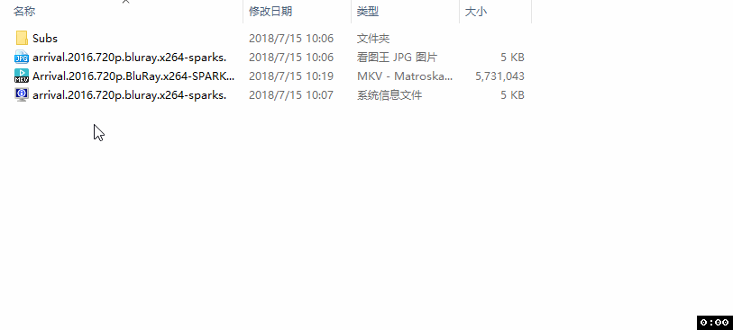
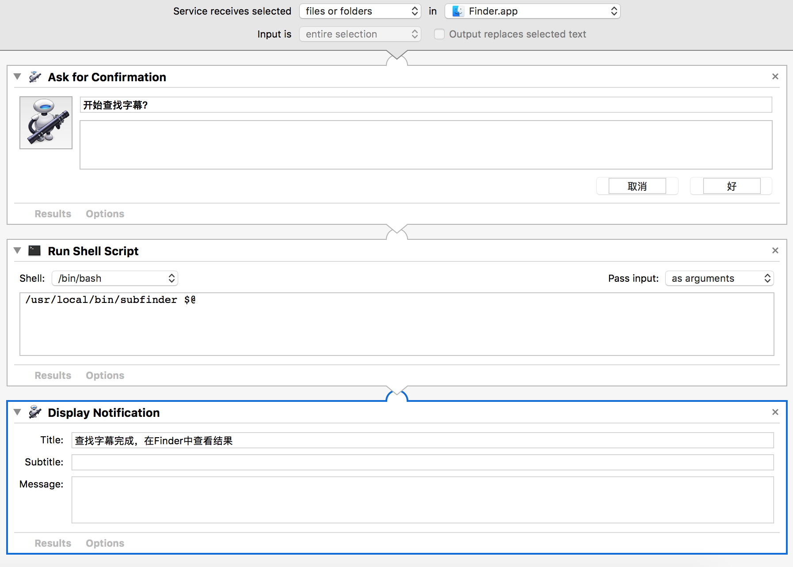

# subsfinder 字幕查找器

subsfinder 是一个通用字幕查找器，可以查找字幕并下载。

---

Table of Contents
=================

  - [特性](#特性)
  - [安装](#安装)
  - [更新](#更新)
  - [使用方法](#使用方法)
    - [命令行](#命令行)
    - [配置文件](#配置文件)
    - [Windows 右键菜单](#windows-右键菜单)
    - [macOS 右键菜单](#macos-右键菜单)
  - [注意事项](#注意事项)
    - [shooter 字幕搜索器](#shooter-字幕搜索器)
    - [zimuku 字幕搜索器](#zimuku-字幕搜索器)
  - [贡献](#贡献)
  - [参考](#参考)
  - [License](#license)
  - [更新历史](#更新历史)
    - [v3.0.1](#v301)


---

## 特性

- 支持提供的 API，可以精确匹配字幕。

- 支持 [射手字幕网](https://www.shooter.cn/), [字幕库](https://www.zimuku.cn/), [字幕组](http://www.zimuzu.io/), [SubHD](https://subhd.tv)。

## 安装

如果你是 Linux 和 macOS 用户，由于系统自带 Python，推荐使用下面的方法安装 subsfinder：

`pip install subsfinder`

安装完成之后，会在 Python 的 scripts 目录下添加一个叫做 subsfinder 的可执行文件。

> 在 unix-like 系统中，scripts 目录一般是 `/usr/local/bin`，在 Windows 系统中，scripts 目录一般是 `C:\python\scripts\`。在 Windows 系统中需要将 `C:\python\scripts\` 加入到 `PATH` 中（一般安装 Python 时已经添加了）。

接下来你就可以在命令行中使用 subsfinder 命令了。


## 更新

如果 subsfinder 是使用 pip 安装的，那么使用 pip 更新，

`pip install subsfinder --upgrade`

## 使用方法

### 命令行

- 使用所有字幕查找器（shooter、zimuku、zimuzu、subhd）查找单个视频的字幕：

  `subsfinder /path/to/videofile`

- 使用所有字幕查找器（shooter、zimuku、zimuzu、subhd）查找目录下（递归所有子目录）所有视频的字幕：

  `subsfinder /path/to/directory_contains_video`

- 使用指定的字幕查找器查找字幕，例如 zimuku：

  `subsfinder /path/to/videofile -m zimuku`

- 同时使用多个字幕查找器查找字幕

  `subsfinder /path/to/videofile -m shooter zimuku`

  当指定多个字幕查找器时，subsfinder 会依次尝试每个字幕查找器去查找字幕。

  ** 注意：** 如果指定了多个字幕查找器，请不要指定 `languages` 参数，否则可能会出现 `LanguageError` 错误（因为每个 `SubsSearcher` 支持的语言可能不相同）。

常用参数说明（详细的参数信息请查看 `subsfinder -h`）：

| 参数              | 含义                                                                                               | 必需                                               |
| ----------------- | -------------------------------------------------------------------------------------------------- | -------------------------------------------------- |
| `-l, --languages` | 指定字幕语言，可同时指定多个。每个字幕查找器支持的语言不相同。具体支持的语言请看下文。             | 否，subsfinder 默认会下载字幕查找器找到的所有字幕。|
| `-e, --exts`      | 指定字幕文件格式，可同时指定多个。每个字幕查找器支持的文件格式不相同。具体支持的文件格式请看下文。 | 否，subsfinder 默认会下载字幕查找器找到的所有字幕。|
| `-m,--method`     | 指定字幕查找器，可同时指定多个。                                                                   | 否，subsfinder 默认使用 shooter 查找字幕。         |
| `-k, --keyword`   | 手动搜索关键字. 当 SubsFinder 使用本身的关键字无法搜索到字幕时, 可以通过这个参数手动指定关键字.    | 否                                                 |
| `--video_exts`    | 视频文件的后缀名（包括.，例如. mp4）                                                               | 否                                                 |
| `--ignore`        | 忽略本地已有的字幕强行查找字幕. 注意: 这可能会覆盖本地已有的字幕. 默认 True。                      | 否                                                 |
| `--exclude`       | 排除文件或目录，支持类似于 shell 的文件匹配模式。详情见下文                                        | 否                                                 |
| `--api_urls`      | 指定字幕搜索器的 API URL。详情见下文                                                               | 否                                                 |
| `-c, --conf`      | 配置文件                                                                                           | 否，SubsFinder 默认从~/.subsfinder.json 读取。     |
| `-s,--silence`    | 静默运行，不输出日志                                                                               | 否                                                 |
| `--debug`         | 调试模式，输出调试日志                                                                             | 否                                                 |
| `-h,--help`       | 显示帮助信息                                                                                       | 否                                                 |

- `--exclude`, 支持的匹配模式类似于 shell，`*` 匹配任意长度的字符串，`?` 匹配一个字符，`[CHARS]` 匹配 CHARS 中的任一字符。例如：

   - 排除包含 `abc` 的目录：`--exclude '*abc*/'`。注意添加单引号，防止 shell 对其进行扩展。

   - 排除包含 `abc` 的文件：`--exclude '*abc*'`。注意和上个例子的区别，匹配目录时结尾有 `/` 目录分隔符，匹配文件则没有。


- `--api_urls`

  [字幕库](http://www.zimuku.la) 的链接不太稳定，有时候会更换域名，因此提供 `--api_urls` 选项自定义 API URL，以防域名或链接变动。

  `--api_urls` 只接收 JSON 格式的字符串。

  获取正确的 API URL 的方法：

  - 字幕库的 API 一般形如 http://www.zimuku.la/search， 这个 URL 就是网页端 “搜索” 功能的 URL。

  - 字幕组的 API 一般形如 http://www.zmz2019.com/search， 这个 URL 同样是网页端 “搜索” 功能的 URL。

  - SubHD 的 API 一般形如 https://subhd.tv/search. 

  - 射手网的 API 比较稳定，一般不会变动。

  **如果发现字幕网站的 API URL 发生改变, 欢迎提交 issue.**

  配置示例：

  ```
  {
    // 设置字幕库的搜索 API
    "zimuku": "http://www.zimuku.la/search",
    // 设置字幕组的搜索 API
    "zimuzu": "http://www.zmz2019.com/search",
    // 设置字幕组获取字幕下载链接的 API, 注意不包含域名
    "zimuzu_api_subtitle_download": "/api/v1/static/subtitle/detail",
    // 设置 SubHD 的搜索 API
    "subhd": "https://subhd.tv/search",
    // 设置 SubHD 获取字幕下载链接的 API, 注意不包含域名
    "subhd_api_subtitle_download": "/ajax/down_ajax",
    // 设置 SubHD 获取字幕预览的 API, 注意不包含域名
    "subhd_api_subtitle_preview": "/ajax/file_ajax"
  }
  ```

支持的语言和文件格式：

| 字幕查找器 | 语言                                | 文件格式       |
| ---------- | ----------------------------------- | -------------- |
| shooter    | ['zh', 'en']                        | ['ass', 'srt'] |
| zimuku     | ['zh_chs', 'zh_cht', 'en', 'zh_en'] | ['ass', 'srt'] |
| zimuzu     | ['zh_chs', 'zh_cht', 'en', 'zh_en'] | ['ass', 'srt'] |
| subhd      | ['zh_chs', 'zh_cht', 'en', 'zh_en'] | ['ass', 'srt'] |

语言代码：

| 代码   | 含义               |
| ------ | ------------------ |
| zh     | 中文，简体或者繁体 |
| en     | 英文               |
| zh_chs | 简体中文           |
| zh_cht | 繁体中文           |
| zh_en  | 双语               |

### 配置文件

配置文件是 JSON 格式的，支持命令行中的所有选项。命令行中指定的选项优先级高于配置文件的。

配置文件中的 key 一一对应于命令行选项，例如 `-m，--method` 对应的 key 为 `method`。

示例：

```json
{
  "languages": ["zh", "en", "zh_chs"],
  "exts": ["ass", "srt"],
  "method": ["shooter", "zimuzu", "zimuku"],
  "video_exts": [".mp4", ".mkv", ".iso"],
  "exclude": ["excluded_path/", "*abc.mp4"],
  "api_urls": {
    // 设置字幕库的搜索 API
    "zimuku": "http://www.zimuku.la/search",
    // 设置字幕组的搜索 API
    "zimuzu": "http://www.zmz2019.com/search",
    // 设置字幕组获取字幕下载链接的 API, 注意不包含域名
    "zimuzu_api_subtitle_download": "/api/v1/static/subtitle/detail",
    // 设置 SubHD 的搜索 API
    "subhd": "https://subhd.tv/search",
    // 设置 SubHD 获取字幕下载链接的 API, 注意不包含域名
    "subhd_api_subtitle_download": "/ajax/down_ajax",
    // 设置 SubHD 获取字幕预览的 API, 注意不包含域名
    "subhd_api_subtitle_preview": "/ajax/file_ajax"
  }
}
```

### Windows 右键菜单

使用命令行下载字幕还是有一点不方便，特别是需要输入路径。

在 widnows 中，可以通过注册表将 subsfinder 添加到右键菜单，使用时右键选中视频文件或者文件夹，然后点击右键菜单中的 “查找字幕”。



** 如何添加注册表：**

- 下载 [注册表文件](https://raw.githubusercontent.com/wflc/subfinder/master/assets/subsfinder.reg)，

- 双击注册表文件 subsfinder.reg 即可添加注册表到系统中。

### macOS 右键菜单

在 macOS 中，通过 Automator 的 Service 实现类似于 Windows 中的右键菜单功能。



使用方法：

- [下载 workflow](https://raw.githubusercontent.com/wflc/subfinder/master/assets/subsfinder.workflow.tar.gz)。
- 解压 subsfinder.workflow.tar.gz。
- 将解压出的 subsfinder.workflow 复制到 / Users/YourName/Library/Services。
- 选中视频文件或目录，右键弹出菜单，选择 “服务（Services）” -> “查找字幕”。

** 注意：在 workflow 中，subsfinder 的路径是 `/usr/local/bin/subsfinder`。**

如果想要了解如何配置 workerflow，可以参考:

- [macOS Automator 帮助](https://support.apple.com/zh-cn/guide/automator/welcome/mac)
- [stackexchange 的这篇回答](https://apple.stackexchange.com/questions/238948/osx-how-to-add-a-right-click-option-in-folder-to-open-the-folder-with-an-applic?utm_medium=organic&utm_source=google_rich_qa&utm_campaign=google_rich_qa)


## 注意事项

### shooter 字幕搜索器

- 由于射手字幕网爬虫的实时性，可能无法查找到最新发布视频的字幕。
- 射手字幕网 API 返回的字幕可能出现 “语言不一致” 问题（指定查找英文字幕却返回中文字幕）。

### zimuku 字幕搜索器

- zimuku 网站明明有字幕可供下载，subsfinder 却提示找不到字幕。可能的原因有：

  - zimuku 字幕搜索器从视频文件名中提取的关键词不够准确，导致搜索结果为空。

  - zimuku 网站修改了 HTML 代码，导致 HTML 解析失败。

- 从 zimuku 网站上下载的字幕一般都是压缩包（zip, rar）。Python 自带的 zipfile 标准库可以解压 zip 压缩包，不过解压 rar 压缩包需要操作系统安装有 unrar 工具。由于 windows 系统安装和配置 unrar 比较麻烦，subsfinder 已经內建 unrar.exe 了。对于 Linux 和 macOS 系统的用户，需要自己手动使用系统包管理工具安装 unrar。

## 贡献

在使用过程中遇到任何问题，请提交 issue。

如果你希望分享你自己的字幕搜索器，欢迎提交 PR。

## 参考

- [射手字幕网 API 使用文档](https://docs.google.com/document/d/1ufdzy6jbornkXxsD-OGl3kgWa4P9WO5NZb6_QYZiGI0/preview)

- [射手字幕网 API](https://www.shooter.cn/api/subapi.php)

## License

[MIT License](LICENSE)

## 更新历史

### v3.0.1

- SubsFinder 采用 [SubFinder](https://github.com/ausaki/subfinder)v2.0.1的代码修改而来.

- SubsFinder 先采用文件名进行字幕搜索，如无搜索结果再采用关键字进行搜索，提高了搜索准确性.

- SubsFinder 如果用多个搜索器搜索，会把每个搜索器找到的字幕都下载下来.
